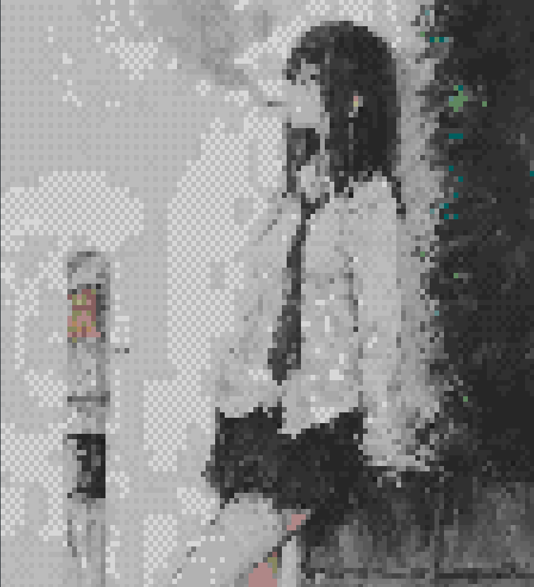

# 🎨 termuwu - Image Rendering in Your Terminal!

🖼️ TermUwU is a simple and flexible CLI tool for rendering images directly in your terminal.
It supports both local files and URLs, and displays them using detailed, colorful ANSI output - no GUI required

<p align="center">
  
  
  
</p>

## 🌟 Features

-   📁 Local image files (PNG, JPEG, GIF, WebP)
-   🌐 Direct URL downloads with a colored progress bar
-   🧱 Multiple rendering modes:
    -   `--full` / `-f` : full character blocks
    -   `--braille` / `-b` : Braille patterns
    -   default: half-block mode
-   🎨 Optional dithering (`--no-dither` / `-n`)
-   📐 Custom width (`-W`) and height (`-H`) in characters

## 🚀 Installation

You can install **termuwu** in a couple of ways depending on your vibe 😼

### 🔹 Option 1: Go Install (recommended)

If you have Go (1.18+) installed, you can install termuwu globally with:

```bash
go install github.com/coffeeboi0811/termuwu@latest
```

Make sure your Go bin directory is in your `PATH`, usually:

```bash
export PATH="$HOME/go/bin:$PATH"
```

After that, you can run `termuwu` from anywhere in your terminal.

### 🔹 Option 2: Build from Source

Clone the repo and build it yourself:

```bash
git clone https://github.com/coffeeboi0811/termuwu.git
cd termuwu
go build -o termuwu
./termuwu show ./your-image.jpg
```

## 💡 Usage Examples

```bash
# Render a local image
termuwu show /path/to/your/image.jpg

# Download and render from URL (wrap in quotes)
termuwu show "https://example.com/image.jpg"

# Custom dimensions with full blocks
termuwu show image.png --width 80 --height 40 --full

# High-detail rendering with braille patterns
termuwu show image.jpg --braille --no-dither
```

## 🛠️ Commands & Flags

**Global Flags:**
Run `termuwu --help` to see the version and global options.

**Subcommands:**

-   `termuwu show [path_or_url]`
    -   Renders the specified image in the terminal.
    -   Flags: `--full` (`-f`), `--braille` (`-b`), `--no-dither` (`-n`), `--width` (`-W`), `--height` (`-H`).

## 🤝 Contributing

Contributions are welcome! Whether it's bug reports, feature requests, or pull requests, your help is appreciated.
